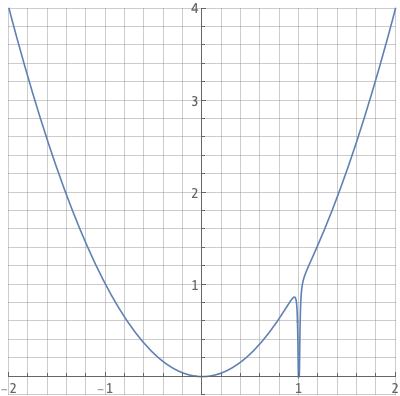
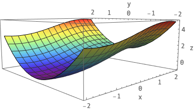
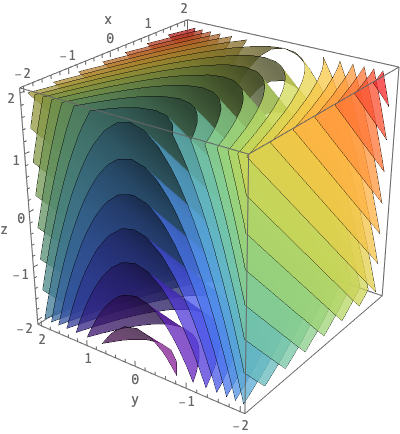

# rvf
For optimizing real-valued functions of several real variables.

## Method

The energy method is simply given by the function provided to the class (or the negative of the function, if a maximum is sought).
The neighbor method picks a random direction, and moves the point by some small amount in that direction (clipping the point if it happens to exit the bounding region).

This example takes advantage of the `format_output` method to reformat the energy when `objective='max'` to actually display the max value, rather than the energy (which is always minimized by the algorithm).

## Usage

```python
from rvf import RvfSolver

solver = RvfSolver(function, initial_state, bounds, objective='min')
solver.anneal(max_steps=max_steps)
```

- `initial_state` must be of the form `[x_1, ..., x_n]`.
- `bounds` must be of the form `[[b_00, b_01], ... [b_n0, b_n1]]`.
- `objective` (optional) must be either `'min'` or `'max'`. Default is `'min'`.


## Examples
To run the example:
```bash
$ python anneal/examples/rvf/rvf_example.py
```

Example output:
```bash
# Optimizing <function f_1 at 0x10d3df1e0> with max_steps = 5000 for 10 runs:
# Run 0: [0.99735912] -0.0052741904313216015
# Run 1: [0.99597491] -0.005947581762798415
# Run 2: [0.99644671] -0.006730642452685731
# Run 3: [0.99695091] -0.006067569957785013
# Run 4: [0.99769036] -0.004613933541806947
# Run 5: [0.99580756] -0.004985679314734481
# Run 6: [0.99704646] -0.005887856807230918
# Run 7: [0.9968905] -0.006177086697768397
# Run 8: [0.99972489] -0.000550152237190682
# Run 9: [0.99782677] -0.004341733934493552
```

### Example 1
This function has a minimum of `-0.0067419337989203` at `x=0.996387676055289` on `[-2, 2]`.<br>
[[Source](https://mathoverflow.net/questions/253450/)]
```python
def f_1(x):
    return x**2 + np.exp(-1/(100*(x - 1))**2) - 1
```



### Example 2
This function has a minimum of `-1` at `(x, y) = (-π/2, 0)` on `[[-2, 2], [-2, 2]]`.
```python
def f_2(x, y):
    return np.sin(x) + y**2
```


### Example 3
This function has a minimum of `-4` at `(x, y, z) = (-2, 0, -2)` on `[[-2, 2], [-2, 2], [-2, 2]]`. 
```python
def f_3(x, y, z):
    return x + y**2 + z
```
