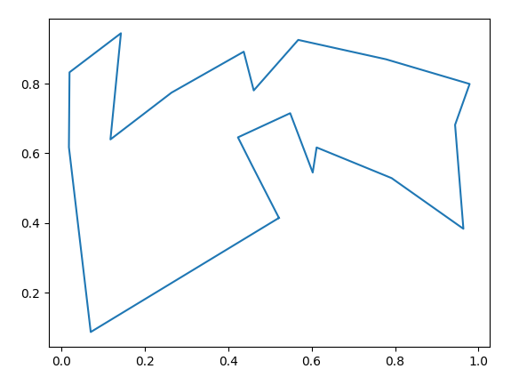

# tsp
For generating possible solutions to the [traveling salesperson problem](https://en.wikipedia.org/wiki/Travelling_salesman_problem) via simulated annealing.

## Method
The energy is simply the total distance of the given route. Neighbors are generated by reversing a random subroute along the current path.

## Usage

```python
from tsp import TravelingSalesPerson

solver = TravelingSalesPerson(cities)
solver.anneal(max_steps=max_steps)
```

`cities` must be a list of coordinate pairs.

## Examples
To run the example:
```bash
$ python anneal/examples/tsp/tsp_example.py
```

Example output:
```bash
# Finding shortest path for:
#
# [[0.5488135  0.71518937]
#  [0.60276338 0.54488318]
#  [0.4236548  0.64589411]
#  [0.43758721 0.891773  ]
#  [0.96366276 0.38344152]
#  [0.79172504 0.52889492]
#  [0.56804456 0.92559664]
#  [0.07103606 0.0871293 ]
#  [0.0202184  0.83261985]
#  [0.77815675 0.87001215]
#  [0.97861834 0.79915856]
#  [0.46147936 0.78052918]
#  [0.11827443 0.63992102]
#  [0.14335329 0.94466892]
#  [0.52184832 0.41466194]
#  [0.26455561 0.77423369]
#  [0.45615033 0.56843395]
#  [0.0187898  0.6176355 ]
#  [0.61209572 0.616934  ]
#  [0.94374808 0.6818203 ]]
#
# Finished - Reached max steps (max_steps = 6000).
# Shortest path length found: 4.401349962513394
```

